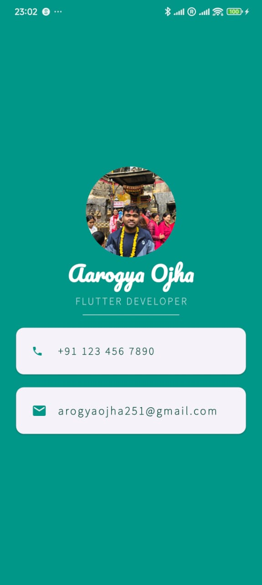

# Flutter Profile Card App

A beautiful and simple Flutter app that displays a personal profile card with a picture, name, profession, phone number, and email address. Designed to showcase basic UI elements in Flutter such as `SafeArea`, `Column`, `CircleAvatar`, `Card`, and custom fonts.

## 📱 Preview



## ✨ Features

- Profile picture with `CircleAvatar`
- Stylish name and profession display
- Contact information with `ListTile` inside `Card`
- Custom fonts and colors
- Mobile-friendly layout

## 🛠️ Built With

- [Flutter](https://flutter.dev/) - UI toolkit for building natively compiled applications
- Dart - Programming language for Flutter

## 📁 Folder Structure

```
lib/
└── main.dart
images/
└── profile.jpg (manually added)
fonts/
└── Pacifico-Regular.ttf (manually added)
└── SourceSans3-VariableFont_wght.ttf(manually added)
```

## 🧰 Getting Started

### Prerequisites

- Flutter SDK installed
- Dart SDK
- Android Studio or VS Code with Flutter extensions

### Installation

1. Clone the repository:

```bash
git clone https://github.com/aarogyaojha/mi_card_flutter.git
cd flutter-profile-card
```

2. Get dependencies:

```bash
flutter pub get
```

3. Run the app:

```bash
flutter run
```

> Make sure to use a real device or emulator for best performance.

## 🖼️ Assets

Add your `profile.jpg` inside the `images/` folder and ensure `pubspec.yaml` includes:

```yaml
flutter:
  assets:
    - images/profile.jpg
```

## 🎨 Fonts

Ensure your custom fonts (`Pacifico` and `Source Sans`) are added and declared in `pubspec.yaml`.

```yaml
fonts:
  - family: Pacifico
    fonts:
      - asset: fonts/Pacifico-Regular.ttf
  - family: Source Sans
    fonts:
      - asset: fonts/SourceSans3-VariableFont_wght.ttf
```

## 📬 Contact

- **Name:** Aarogya Ojha  
- **Email:** [arogyaojha251@gmail.com](mailto:arogyaojha251@gmail.com)  

## 📄 License

This project is licensed under the MIT License - see the [LICENSE](LICENSE) file for details.

---

> Made with ❤️ in Flutter
